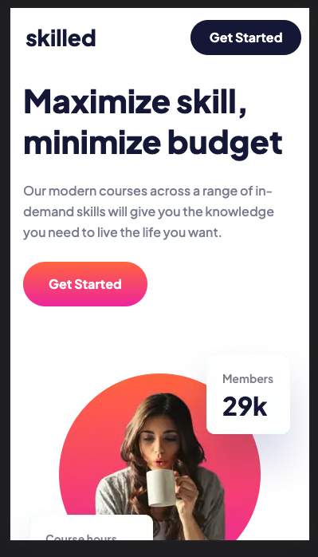
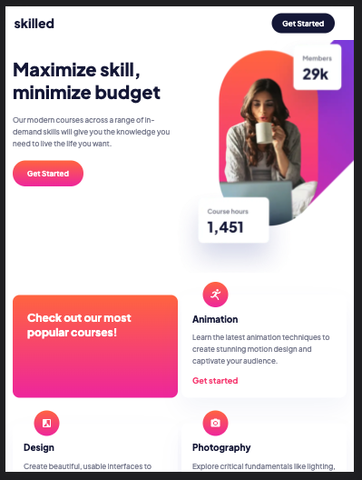
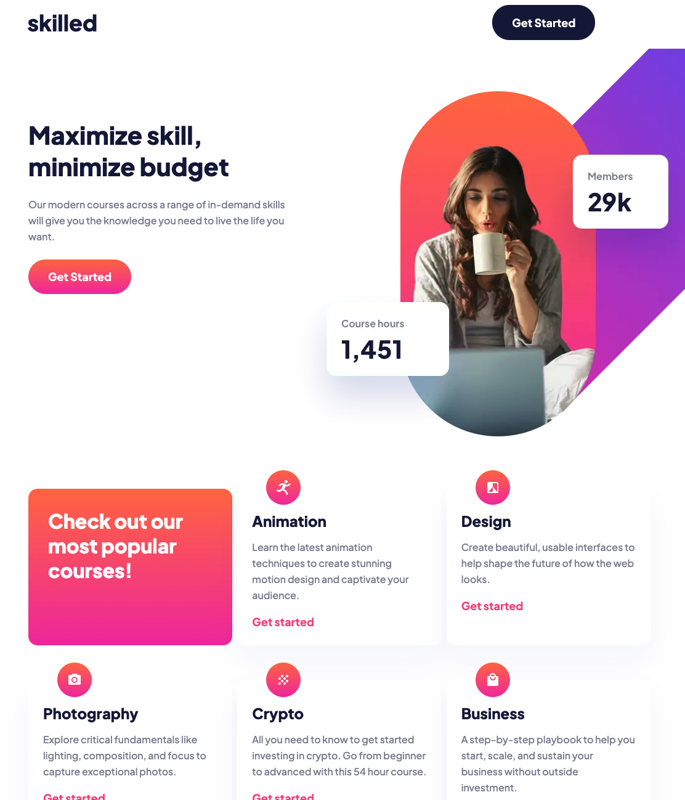

# Frontend Mentor - Skilled e-learning landing page solution

This is a solution to the [Skilled e-learning landing page challenge on Frontend Mentor](https://www.frontendmentor.io/challenges/skilled-elearning-landing-page-S1ObDrZ8q). Frontend Mentor challenges help you improve your coding skills by building realistic projects.

## Table of contents

- [Overview](#overview)
  - [The challenge](#the-challenge)
  - [Screenshot](#screenshot)
  - [Links](#links)
- [My process](#my-process)
  - [Built with](#built-with)
  - [What I learned](#what-i-learned)
  - [Continued development](#continued-development)
- [Author](#author)

## Overview

### The challenge

Users should be able to:

- View the optimal layout depending on their device's screen size
- See hover states for interactive elements

### Screenshot

### Links

- Solution URL: [FEM solution](https://www.frontendmentor.io/solutions/responsive-landing-page-using-html-and-sass-ulgBINRbHN)
- Live Site URL: [Deployed with netlify](https://zesty-sable-ec4185.netlify.app/)

## My process

### Built with

- Semantic HTML5 markup
- CSS custom properties
- Sass
- Flexbox
- Mobile-first workflow

### What I learned

This was a great reinforcer for applying design a design system before working on the page. It was probably too small of a project for a design system but I wanted practice.

### Continued development

I'd definitely like to streamline my sass after getting feedback

## Author

- LinkedIn - [Layne Taylor](https://www.your-site.com)
- Frontend Mentor - [@laynet](https://www.frontendmentor.io/profile/laynet)
- Twitter - [@laynerzzzz](https://www.twitter.com/laynerzzzz)
